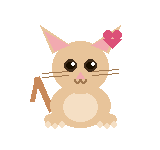

# Hi, I'm Sidratul Muntaha 🐾

**Computer Science & Engineering Undergraduate @ CUET**

*I enjoy building intelligent systems, exploring machine learning, and developing software that solves real-world problems.*

## ✦ Interests

- 🤖 Machine Learning & Artificial Intelligence
- 👁️ Computer Vision & VLM
- 💬 Natural Language Processing
- 🌐 Full-Stack Development
- 🔬 Research & Innovation

## ✦ Tech Stack

**Languages:** `Python` · `C++` · `JavaScript` · `SQL`

**Frameworks & Tools:** `Django` · `React` · `Next.js` · `Git` · `Linux`

## ✦ Currently Exploring

| Area | Focus |
|---|---|
| 🧠 VLM | Vision-Language Models |
| 🎭 Multimodal AI | Cross-modal understanding |
| 👀 Computer Vision | Visual perception systems |
| 🔧 Research Engineering | Bridging theory & practice |

## ✦ Highlights

> 🏆 Active participant in technology competitions and research projects

## ✦ Goal

> *"To bridge research and engineering by building impactful AI-driven solutions."*

## ✦ Connect

&nbsp;

  🐾 &nbsp; Learning, building, and improving — one project at a time. &nbsp; 🐾

