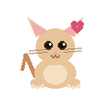

### Sidratul Muntaha

Computer Science & Engineering - CUET

I build intelligent systems, and the ordinary software that has to hold them up.
Machine learning, computer vision, and language - plus the competitions and
research projects that happen around coursework.

 

---

**Working on** &nbsp;·&nbsp; vision-language models &nbsp;·&nbsp; NLP &nbsp;·&nbsp; full-stack systems &nbsp;·&nbsp; research experiments

**Reaching for** &nbsp;·&nbsp; LLMs &nbsp;·&nbsp; multimodal understanding &nbsp;·&nbsp; visual perception &nbsp;·&nbsp; research engineering

**Building with** &nbsp;·&nbsp; `Python` &nbsp;`C++` &nbsp;`JavaScript` &nbsp;`SQL` &nbsp;·&nbsp; `Django` &nbsp;`React` &nbsp;`Next.js` &nbsp;`Git` &nbsp;`Linux`

---

> Ideas that look good on paper are the easy half.
> I care about the other half - making them run reliably enough to be useful.

 

[LinkedIn](https://www.linkedin.com/in/sidratulmuntaha-58861b265) &nbsp;·&nbsp; [smuntaha226@gmail.com](mailto:smuntaha226@gmail.com)

🐾 one project at a time.
