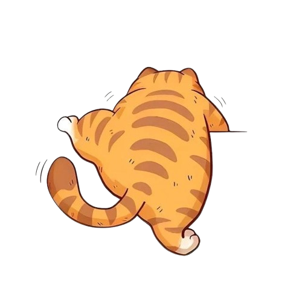

### Sidratul Muntaha

Computer Science & Engineering - CUET

I build machine learning systems and the software that keeps them running.
I work on research projects and competitions alongside my coursework.

 

---

**Focus**
Vision-language models · NLP · Multimodal AI · Full-stack systems

**Tech**
`Python` `C++` `JavaScript` `SQL` · `Django` `FastAPI` `React` `Next.js` · `Git` `Linux`

---

> Ideas that look good on paper are the easy half.
> I care about the other half - making them run reliably enough to be useful.

 

[LinkedIn](https://www.linkedin.com/in/sidratulmuntaha-58861b265) &nbsp;·&nbsp; [smuntaha226@gmail.com](mailto:smuntaha226@gmail.com)

Wa ma tawfiqi illa billah: "My success is only with Allah." (Quran 11:88)
